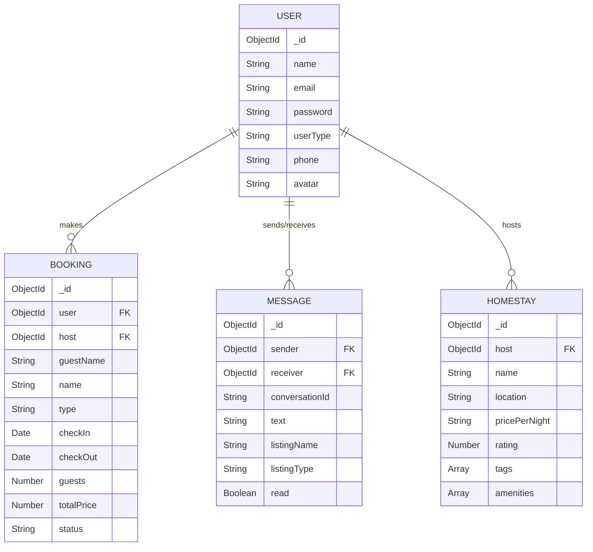

# EcoExplorer — AI-Assisted Eco-Tourism & Homestay Platform

EcoExplorer is a modern, full-stack platform designed to facilitate sustainable travel, eco-friendly stays, and green tourism. Built using the MERN stack (MongoDB, Express, React, Node.js), Tailwind CSS v4, and integrated with the Google Gemini API.

---

## 🌿 Features

### Core Modules
* **AI Travel Planner**: Interactive, context-aware travel planner powered by `gemini-3.5-flash` with automatic request formatting, real-time loading/typing state animations, and descriptive error dialogs.
* **In-App Messaging System**: A full traveler-host chat room with unread count notification badges, automated email notifications for new inquiries, quick-reply dashboard integrations, and granular message/full chat delete options.
* **Host & Admin Dashboards**: Dynamic metrics cards tracking total listings, active bookings, unread incoming queries, ratings, and revenue, alongside table-based approval workflows for host management.
* **Authentication Gating**: Secure client-side route guards powered by JWT tokens, persistent session context local-storage, and passport-based Google/GitHub OAuth integrations.

### Navigation / Routing
* `/` — Explore featured eco-lodges, homestays, and green destinations.
* `/destinations` — Directory of available green travel points.
* `/homestays` — Discover homestay opportunities.
* `/travel-planner` — Prompt-engineered AI itinerary assistance.
* `/messages` — Two-panel real-time chat interface.
* `/owner-dashboard` — Control center for homestay owners and managers.
* `/profile` — User account configuration.

---

## 📁 Repository Structure

```
EcoExplorer/
├── backend/                # Node.js + Express API Service
│   ├── controllers/        # Business logic controllers (Auth, AI, Message, Bookings)
│   ├── models/             # Mongoose schemas (User, Message, Booking, Homestay, Destination)
│   ├── routes/             # Express route mappings
│   ├── middleware/         # Auth verification, role checks, error handlers
│   └── server.js           # Server application configuration
├── src/                    # Frontend React Application
│   ├── context/            # React Auth context & session providers
│   ├── components/         # Reusable widgets (AIChat, Navbar, SearchBar)
│   ├── pages/              # Primary route view components & CSS sheets
│   ├── App.jsx             # React routing & route guards
│   └── index.css           # Global theme styling config (Tailwind v4)
└── PROMPTS.md              # AI engineering prompt log
```

---

## 🗄️ Database Schema & Architecture

**Database Chosen:** MongoDB (with Mongoose)



---

## 🚀 Getting Started Locally

### 1. Backend Service
1. Navigate to the backend directory:
   ```bash
   cd backend
   ```
2. Install dependency files:
   ```bash
   npm install
   ```
3. Set up your `.env` configuration file:
   ```bash
   cp .env.example .env
   ```
   * Configure `MONGO_URI`, `JWT_SECRET`, and `GEMINI_API_KEY`.
4. Run the database seed script to populate mock items:
   ```bash
   npm run seed
   ```
5. Start development hot-reloading server:
   ```bash
   npm run dev
   ```

### 2. Frontend React Service
1. Navigate to the project root:
   ```bash
   cd ..
   ```
2. Install dependency files:
   ```bash
   npm install
   ```
3. Start the local server:
   ```bash
   npm run dev
   ```
4. Open [http://localhost:3000](http://localhost:3000) in your browser.

---

## 📡 API Reference

### AI Travel Assistant
* `POST /api/ai/chat` — Generates a concise, formatted travel itinerary from user messages.

### Message Board
* `GET /api/messages/conversations` — Retrieves all message threads for the logged-in user.
* `GET /api/messages/unread-count` — Count of unread messages.
* `GET /api/messages/:userId` — Fetch thread history with a specific user.
* `POST /api/messages` — Send a new in-app message.
* `DELETE /api/messages/:messageId` — Delete a single sent message.
* `DELETE /api/messages/conversation/:userId` — Delete the entire chat history with a user.
